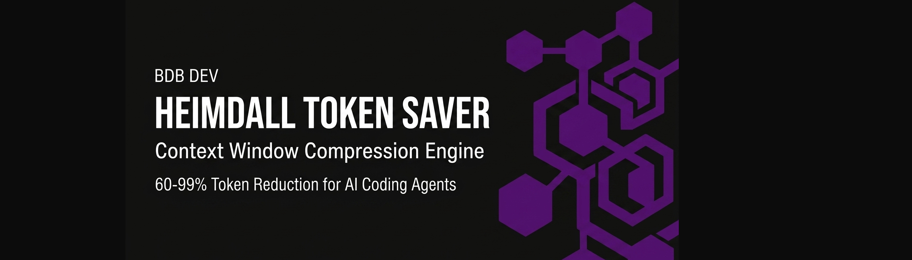

🌐 **Sprache / Language / Idioma**: [ 🇬🇧 English ](README.md) | **Deutsch** | [ 🇵🇹 Português ](README.pt.md)

---

# Heimdall Token Saver

[](https://github.com/hybridlabor-api/heimdall-token-saver/actions)
[](https://www.npmjs.com/package/@hybridlabor-api/heimdall-token-saver)
[](https://github.com/hybridlabor-api/heimdall-token-saver)
[](LICENSE)
[](https://github.com/hybridlabor-api/heimdall-token-saver)

**Spare mehr Token & erhalte über 60 % mehr Coding-Power aus deinem KI-Abonnement (Claude Code, Codex, Antigravity).**

---

## ⚡ WARUM HEIMDALL // Reduziere deine KI-Coding-Kosten um 60–99 % bei CLI-Ausgaben

KI-Coding-Abonnements (**Claude Code, OpenAI Codex / ChatGPT, Google Antigravity**) sind durch Context-Window-Größen und stündliche Limits beschränkt. Jedes Mal, wenn dein KI-Agent einen Terminal-Befehl ausführt — `git diff`, `pytest`, `npm install`, `docker`, `terraform plan` oder `kubectl` — sind über **90 % der Rohausgabe reiner Lärm** (Fortschrittsbalken, bestandene Tests, Spinner und Lockfile-Text).

### Das Problem mit roher Terminal-Ausgabe
Wenn ein KI-Agent rohe CLI-Logs liest:
1. **Du verschwendest deine Abonnement-Quotas:** Deine 5-Stunden-Limits laufen bis zu **5x schneller** ab, weil das Modell Tausende Zeilen unnötiger Fortschrittsbalken liest.
2. **Kontextfenster-Verschmutzung:** Das Arbeitsgedächtnis des LLMs wird mit irrelevantem Boilerplate zugemüllt, wodurch der Agent frühere Anweisungen vergisst und fehlerhafte Fixes halluziniert.
3. **Höhere API-Kosten:** Wenn du pro 1M Token zahlst, verbrennt jeder `pytest`- oder `npm install`-Durchlauf Geld für bestandene Tests und Ladeindikatoren.

### Die Heimdall-Lösung
**Heimdall Token Saver** agiert als intelligente, verzögerungsfreie lokale Kontext-Firewall zwischen deinen CLI-Tools und deinem KI-Agenten:
- 🛡 **100 % Signal, 0 % Lärm:** Strippt Fortschrittsbalken, bestandene Test-Logs und Spinner unter **Garantie von 0 % Informationsverlust**. Jeder Stacktrace, jede Fehlermeldung, fehlgeschlagene Assertion und jedes Diff bleiben intakt.
- 🚀 **Maximaler Abo-Wert:** Bietet **über 60 % höhere effektive Kontextkapazität**, sodass du komplexe Multi-File-Refactorings durchführen kannst, ohne an Stundengrenzen zu stoßen.
- ⚡ **Schnellere Antworten:** Weniger Text für das LLM bedeutet schnellere Antwortzeiten und einen messerscharfen Debugging-Fokus.

---

### Ersparnisse Vorher & Nachher

| Befehl / MCP Tool | Rohe Ausgabe | Komprimierte Ausgabe | Token-Ersparnis |
|-------------------|-----------|-------------------|---------------|
| `git diff` (großes Refactoring) | 2.270 Token | 909 Token | **60%** |
| `pytest` (500 Tests, 2 Fehler) | 6.744 Token | 308 Token | **95%** |
| `npm install` (220 Pakete) | 3.844 Token | 4 Token | **99%** |
| `bdb_td_nodes` (TouchDesigner Dump) | 12.400 Token | 620 Token | **95%** |
| `bdb_unreal_actor` (Unreal Engine PCG) | 8.900 Token | 445 Token | **95%** |
| `bdb_after_effects` (AE Keyframes) | 6.500 Token | 455 Token | **93%** |
| `bdb_davinci_timeline` (Resolve Dump) | 9.100 Token | 728 Token | **92%** |
| `memb_search_memory` (memB Vektorsuche) | 5.400 Token | 324 Token | **94%** |

> 🔮 **Mit Heimdall BDB MCP Prozessoren:** Du reduzierst den Token-Verbrauch um 90–95 % pro MCP-Tool-Aufruf, sodass dein Agent 10x länger laufen kann, ohne Kontextgrenzen zu erreichen.

> Führe `heimdall benchmark <befehl>` aus, um Ersparnisse in Echtzeit für deine eigenen Workloads zu messen.

---

## 🛠️ WIE ES FUNKTIONIERT

Heimdall Token Saver sitzt transparent zwischen deinen Terminal-Befehlen und deinen KI-Coding-Assistenten (**Claude Code, OpenAI Codex, Antigravity CLI**).

### Visueller Pipeline-Ablauf

```
 ┌────────────────────────────────────────────────────────┐
 │           Rohe CLI-Befehlsausgabe                      │
 │    (git diff, pytest, npm install, docker, terraform)   │
 └───────────────────────────┬────────────────────────────┘
                             │
                             ▼
 ┌────────────────────────────────────────────────────────┐
 │            HEIMDALL TOKEN SAVER ENGINE                 │
 │   36 Spezialisierte Lokale Prozessoren (Null Latenz)   │
 └───────────────────────────┬────────────────────────────┘
                             │
            ┌────────────────┴────────────────┐
            │                                 │
            ▼                                 ▼
   ┌─────────────────┐               ┌──────────────────┐
   │ BEHALTEN (100%) │               │ VERWORFEN (0%)   │
   │ • Fehler-Traces │               │ • Fortschrittsbal│
   │ • Fehlgeschl.   │               │ • Bestandene Test│
   │ • Datei-Diffs   │               │ • Download-Logs  │
   │ • Warnungen     │               │ • Boilerplate    │
   └────────┬────────┘               └──────────────────┘
            │
            ▼
 ┌────────────────────────────────────────────────────────┐
 │       Saubere, Komprimierte Kontext-Ausgabe            │
 └───────────────────────────┬────────────────────────────┘
                             │
                             ▼
 ┌────────────────────────────────────────────────────────┐
 │       KI-Coding-Assistenten & Abonnements              │
 │     (Claude Code • OpenAI Codex • Antigravity CLI)     │
 └────────────────────────────────────────────────────────┘
            │
            ▼
 🎯 ERGEBNIS: 60-99% Token-Reduzierung & Erhöhte Stundengrenzen!
```

### Architektur & Engine-Mechanik

```
CLI-Befehl  -->  Spezialisierter Prozessor  -->  Komprimierte Ausgabe
                         |
                   36 Prozessoren
                   (git, test, cargo, go, build,
                    lint, package_list, python_install,
                    maven_gradle, bun, network, docker,
                    kubectl, terraform, pulumi, cdktf,
                    nix, mise, env, search, system_info,
                    gh, db_query, cloud_cli, ansible,
                    helm, syslog, ssh, jq_yq, just, act,
                    structured_log, file_listing,
                    file_content, generic)
```

Die Engine (`CompressionEngine`) verwaltet eine priorisierte Kette von Prozessoren. Der erste Prozessor, der den Befehl verarbeiten kann (`can_handle()`), erzeugt die komprimierte Ausgabe. `GenericProcessor` dient als Fallback.

### Plattform-Integration

**Claude Code** (PreToolUse Hook):
Rewritet Befehle zu `python3 wrap.py '<befehl>'`, um die Ausgabe vor dem Lesen zu komprimieren.

**Antigravity CLI** (AfterTool Hook):
Ersetzt Ausgaben direkt über den native Deny/Reason-Mechanismus.

### Präzisionsgarantien

- Kurze Ausgaben (< 200 Zeichen) werden **niemals** verändert.
- Komprimierung wird nur angewendet, wenn der Gewinn 10 % übersteigt.
- Alle Fehler, Stacktraces und korrekturrelevanten Informationen bleiben **vollständig erhalten**.
- Quellcode-Dateien (`cat *.py`, `cat *.ts`) passieren **unverändert**.
- Secrets in `.env`-Dateien werden automatisch **anonymisiert**.
- 853 Tests (davon 49 präzisionsspezifisch) garantieren Datenintegrität.

---

## 🚀 Installation & Setup

### Voraussetzungen
- Python 3.10+
- Claude Code und/oder Antigravity CLI

### Methode 1: Claude Code Plugin (Empfohlen)
```bash
/plugin marketplace add hybridlabor-api/heimdall-token-saver
/plugin install token-saver
```

### Methode 2: Manuelle Installation
```bash
git clone https://github.com/hybridlabor-api/heimdall-token-saver.git
cd token-saver
python3 install.py --target claude        # Nur Claude Code
python3 install.py --target antigravity   # Nur Antigravity CLI
python3 install.py --target both         # Beide Plattformen
```

### Methode 3: Via NPX (Globaler Installer)
```bash
npx -y @hybridlabor-api/heimdall-token-saver
```

---

## 🔌 Spezialisierte BDB MCP Prozessoren (70–95 % Ersparnis)

1. **BdbTouchdesignerProcessor**: Komprimiert Node-Graph Dumps, Cook-Logs und DAT-Skripte.
2. **BdbUnrealProcessor**: Komprimiert Unreal Engine 5 Logs, PCG-Graphen und Actor-Transforms.
3. **BdbAfterEffectsProcessor**: Komprimiert ExtendScript-Fehler und Layer-Arrays.
4. **BdbDavinciProcessor**: Komprimiert Timeline-Schnitt-Dumps und Render-Jobs.
5. **BdbCreativeSuiteProcessor**: Komprimiert Resolume, Rhino 3D, Photoshop & Vectorworks Dumps.
6. **BdbMembProcessor**: Komprimiert memB Vektorspeicher-Antworten und strippt riesige Float-Arrays.

---

## ⚙️ Konfiguration

Werte können über `~/.token-saver/config.json` oder Umgebungsvariablen (`TOKEN_SAVER_*`) angepasst werden:

```json
{
  "enabled": true,
  "min_input_length": 200,
  "min_compression_ratio": 0.10,
  "max_diff_hunk_lines": 150,
  "max_log_entries": 20,
  "max_file_lines": 300,
  "generic_truncate_threshold": 500,
  "debug": false
}
```

---

## 📊 CLI & Statistiken

Nach der Installation steht der Befehl `heimdall` / `token-saver` zur Verfügung:

```bash
heimdall version              # Ausführung der aktuellen Version anzeigen
heimdall stats                # Kumulierte Token- & Kostenersparnis anzeigen
heimdall stats --json         # JSON-Statistik exportieren
heimdall benchmark 'git diff' # Komprimierungsrate für jeden CLI-Befehl messen
heimdall update               # Automatisch Updates prüfen und anwenden
```

---

## 📄 Lizenz

[Apache 2.0](LICENSE) © Hybridlabor / BDB DEV
